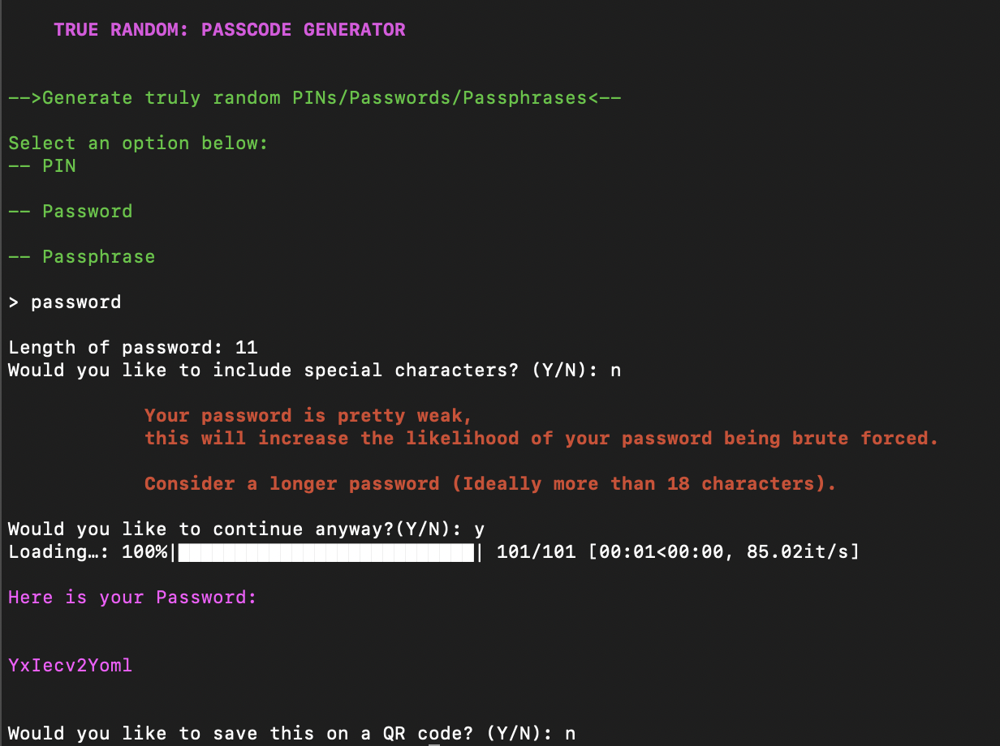

.. _closed_lock_with_key-truly-random-password-generator-closed_lock_with_key:

🔐 Truly Random password generator 🔐
-----------------------------------

Abstract:
---------

Using Python script you can generate completely random and secure: PINs,
Passwords and multi-word Passphrases of any length you choose. Using the
script allows you to choose them completely at random without your
intervention.

Introduction
------------

For years, many of use have lived the same life with respect to how we
operate online: We use the same passwords for multiple accounts for
months/years, eventually forgetting and having to reset it. If you are
like I was, then your 'new' password was just a variation of the old one
with some slight modification. Depending on the site or service you sre
creating a password for, they may ask for your lock to meet certain
requirements (minimum of 8 characters long, include at least 1 numbers
and special character... seem familiar?) There is a good reason for
this, entropy.

   Password Entropy is a measurement of difficulty or 'randomness!'

The more letters (upper and lowercase), numbers and special characters
(?/!@#$%...) you add, the harder it makes it for a hacker to `brute
force attack <https://en.wikipedia.org/wiki/Brute-force_attack>`__ your
account and gain access to your sensitive data.

Let's take a look at some length examples and their strengths:
^^^^^^^^^^^^^^^^^^^^^^^^^^^^^^^^^^^^^^^^^^^^^^^^^^^^^^^^^^^^^^

.. raw:: html

   

..

   Notice with just lowercase letters it would take hackers 23Mln years
   to hack your accounts/data when your lock is 18 characters long...

   A word of caution though, as computers and software advance, these
   times will shorten drastically. Notice how a lock of only 8
   characters, being mixed cased and including numbers, only takes 1
   hour to crack. That is scary!

As you can see in the above chart, the more characters in your lock, the
harder it makes it for hackers to use hacking software to brute force
your data/accounts. Even with just numbers, it would take 9 months for a
hacker to crack it when the lock is at least 18 numbers long. This will
only increase when you begin to add, letters and symbols. Even adding
one or two symbols increases your password entropy drastically.

PIN Generator:
~~~~~~~~~~~~~~

::

           Welcome to True Random!!!
   -->Generate truly random PINs/Passwords/Passphrases<--

   Select an option below:
   -- PIN

   -- Password

   -- Passphrase
              
   > pin

   Length of your new PIN: 12
   Loading…: 100%|██████████████████████████| 101/101 [00:01<00:00, 88.63it/s]

   Here is your PIN: 

   820768192734

   Would you like to save this on a QR code? (Y/N): y

Password generator:
~~~~~~~~~~~~~~~~~~~

::

           Welcome to True Random!!!
   -->Generate truly random PINs/Passwords/Passphrases<--

   Select an option below:
   -- PIN

   -- Password

   -- Passphrase
              
   > password

   Length of password: 24
   Would you like to include special characters? (Y/N): y
   Loading…: 100%|██████████████████████████| 101/101 [00:01<00:00, 88.50it/s]

   Here is your Password: 

   {z-&z;.#)#]g+3'*g(h$3p`]

   Would you like to save this on a QR code? (Y/N): y

::

           Welcome to True Random!!!
   -->Generate truly random PINs/Passwords/Passphrases<--

   Select an option below:
   -- PIN

   -- Password

   -- Passphrase
              
   > password

   Length of password: 24
   Would you like to include special characters? (Y/N): n
   Loading…: 100%|██████████████████████████| 101/101 [00:01<00:00, 85.60it/s]

   Here is your Password: 

   EaM8mpJGyzWE0yvEekyaVlkL

   Would you like to save this on a QR code? (Y/N): y

Passphrase Generator:
~~~~~~~~~~~~~~~~~~~~~

::

           Welcome to True Random!!!
   -->Generate truly random PINs/Passwords/Passphrases<--

   Select an option below:
   -- PIN

   -- Password

   -- Passphrase
              
   > passphrase

   How many words: 12
   Loading…: 100%|██████████████████████████| 101/101 [00:01<00:00, 88.13it/s]

   Here is your Passphrase: 

   Unticketed 
   Duffer 
   Applaudable 
   Ajutment 
   Flaxseed 
   Thiocarbamic 
   Sundayproof 
   Bonelessness 
   Chiam 
   Wobbliness 
   Rostellarian 
   Assertrix

   Would you like to save this on a QR code? (Y/N): y

Code for qr code function
'''''''''''''''''''''''''

::

           Welcome to True Random!!!
   -->Generate truly random PINs/Passwords/Passphrases<--

   Select an option below:
   -- PIN

   -- Password

   -- Passphrase
              
   > passphrase

   How many words: 4
   Loading…: 100%|██████████████████████████| 101/101 [00:01<00:00, 86.10it/s]

   Here is your Passphrase: 

   Ferrado 
   Entomic 
   Incognito 
   Numismatician

   Would you like to save this on a QR code? (Y/N): y

This will result in a qr code PNG image that stores the string "Ferrado
Entomic Incognito Numismatician", if you would like to see it for
yourself scan the qr code with your phone.

|newfile|

Updates
-------

Warning message for passwords less than 14 characters:
^^^^^^^^^^^^^^^^^^^^^^^^^^^^^^^^^^^^^^^^^^^^^^^^^^^^^^

In an effort to get people to start using longer passwords, I have added
in an error message that lets users know that a shorter password leaves
them vulnerable to brute force attacks.

::

           Welcome to True Random!!!
   -->Generate truly random PINs/Passwords/Passphrases<--

   Select an option below:
   -- PIN

   -- Password

   -- Passphrase
              
   > password

   Length of password: 11
   Would you like to include special characters? (Y/N): n

               Your password is pretty weak, 
               this will increase the likelihood of your password being brute forced. 

               Consider a longer password (Ideally more than 18 characters).
                   
   Would you like to continue anyway?(Y/N): y
   Loading…: 100%|██████████████████████████| 101/101 [00:01<00:00, 86.31it/s]

   Here is your Password: 

   uq8orKlZ0MW

   Would you like to save this on a QR code? (Y/N): n
   
CLI styling
^^^^^^^^^^^
Using the 'click' library I was able to add some styling to the CLI:

.. _warning-warning-this-password-generator-is-not-field-tested-please-understand-that-if-you-decide-to-use-this-that-you-are-doing-so-at-your-own-risk:

⚠️ **Warning:** This password generator is not field tested, please understand that if you decide to use this that you are doing so at your own risk.
-----------------------------------------------------------------------------------------------------------------------------------------------------

.. |newfile| image:: https://user-images.githubusercontent.com/91287801/208255474-7f31880d-ad38-413c-93ab-dabbb4286e80.png
